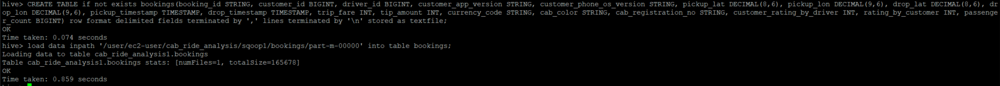

# YourOwnCabs (YOC) Big Data Engineering Project

## Overview

YourOwnCabs (YOC) is an online on-demand cab booking service. Due to the company's rapid growth, it has become essential to derive quick and on-demand insights regarding various business metrics. This project focuses on building a data pipeline that processes booking and clickstream data, stores it in a Hadoop environment, and makes it queryable using Hive. The key tasks include ingesting data from Kafka and AWS RDS, creating aggregate tables, and performing various analyses.

## Architecture

The architecture consists of the following components:

1. **Kafka** for streaming clickstream data.
2. **AWS RDS** for storing booking data.
3. **Hadoop HDFS** for storing raw and processed data.
4. **Spark** for processing and aggregating data.
5. **Hive** for making data queryable.

 _Insert Architecture Diagram here_

## Approach

Before anything, make sure you create a user in hdfs file system and give ownership of the newly created folder to store the results to the user.

For eg, user used below 0s ‘ec2-user’ and the folder created to store the results are ‘cab_ride_analysis’

```bash
sudo -i 
su – hdfs
hadoop fs -mkdir /user/ec2-user
hadoop fs -mkdir /user/ec2-user/cab_ride_analysis
hadoop fs -chown ec2-user /user/ec2-user/cab_ride_analysis
```

### Task 1: Consume Clickstream Data from Kafka and Ingest to Hadoop

To perform the above task, you need to run two pyspark scripts:

- spark_kafka_to_local.py
- spark_local_flatten.py

Run the below command to download the Spark-SQL-Kafka jar file. This jar will be used to run the Spark Streaming-Kafka codes. Please copy-paste the below command in your EC2 instance terminal.

```bash
wget https://ds-spark-sql-kafka-jar.s3.amazonaws.com/spark-sql-kafka-0-10_2.11-2.3.0.jar
```

Running the first script will stream the data into the HDFS files system as raw data. No functions are applied here, only the data from kafka is stored into the HDFS. You can define the kafka server and topic name in lines 12 and 13. The command to run the same is given below.

```
spark2-submit --jars spark-sql-kafka-0-10_2.11-2.3.0.jar spark_kafka_to_local.py
```

The output of the command is given below


Running the second script will flatten the data into a more structured format and save it as a CSV in HDFS, so hive can fetch it from there. Command to run the script is given below.

```
spark2-submit spark_local_flatten.py”
```

The output of the command is given below


### Task 2: Ingest Booking Data from AWS RDS to Hadoop

Run the following sqoop import command to import the bookings data from AWS RDS to Hadoop

```sqoop
sqoop import --connect jdbc:mysql://upgraddetest.cyaielc9bmnf.us-east-1.rds.amazonaws.com/testdatabase --table bookings --username student --password STUDENT123 --target-dir /user/ec2-user/cab_ride_analysis/sqoop/bookings -m 1
```

Above command gives the following output


### Task 3: Create Aggregates for Date-Wise Total Bookings Using Spark

Run the “datewise_bookings_aggregates_spark.py” file like shown below to create a csv file with date-wise aggregated bookings total table.

```
spark2-submit datewise_bookings_aggregates_spark.py
```


### Task 4: Create Hive Tables

To create a hive table, you need to log into the hive command line interface first, from hdfs user type in “hive” and press enter.

This command will create the database and use the database.

```sql
Create database if not exists cab_ride_analysis;
use cab_ride_analysis;
```

Create a Hive-managed table from clickstream data.

To create the table run the following command:

```sql
CREATE TABLE if not exists clickstreamData(customer_id BIGINT, app_version STRING, os_version STRING, 
lat DECIMAL(8, 6), lon DECIMAL(9,6), page_id STRING, button_id STRING, 
is_button_click STRING, is_page_view STRING, is_scroll_up STRING, is_scroll_down STRING, 
timestamp TIMESTAMP) row format delimited fields terminated by '' lines terminated by '\n' stored as textfile;
```

To load the data into the table:

```
load data inpath '/user/ec2-user/cab_ride_analysis/kafka/clickstreamdump/csv/part-00000-e2eb68ab-a30b-48c9-af5c-b74052a5222d-c000.csv' into table clickstreamdata;
```


To create the table run the following command:

```sql
CREATE TABLE if not exists bookings(booking_id STRING, 
customer_id BIGINT, driver_id BIGINT, customer_app_version STRING, 
customer_phone_os_version STRING, pickup_lat DECIMAL(8,6), 
pickup_lon DECIMAL(9,6), drop_lat DECIMAL(8,6), drop_lon DECIMAL(9,6), 
pickup_timestamp TIMESTAMP, drop_timestamp TIMESTAMP, trip_fare INT, tip_amount INT, 
currency_code STRING, cab_color STRING, cab_registration_no STRING, 
customer_rating_by_driver INT, rating_by_customer INT, passenger_count BIGINT) 
row format delimited fields terminated by ',' 
lines terminated by '\n' stored as textfile;
```

To load the data into the table:

```
load data inpath '/user/ec2-user/cab_ride_analysis/sqoop/bookings/part-m-00000' into table bookings;
```



To create the table run the following command:

```sql
CREATE TABLE aggBookings(Date DATE, count INT) 
row format delimited fields terminated by '|' 
lines terminated by '\n' stored as textfile;
```

To load the data into the table:

```
load data inpath '/user/ec2-user/cab_ride_analysis/aggBookings/results/part-00000-46a0ff75-0ba6-4c2b-b1d3-69fb467d5624-c000.csv' into table aggBookings;
```


### Task 5: Calculate Total Number of Different Drivers for Each Customer

**Query:**

```sql
select customer_id as Customer, count(driver_id) NoOfDrivers from bookings group by customer_id;
```

 **Explanation:** The number of drives for each customer can be found out by grouping the customer_id and counting the number of drives for unique customer_id.


### Task 6: Calculate Total Rides Taken by Each Customer

**Query:**

```sql
select customer_id as Customer, count(booking_id) as NoOfRides from bookings group by customer_id;
```

**Explanation** : The total rides taken by each customer can be found out by grouping the customer_id and couting the booking_ids for each user which essentials gives the number of rides taken by each customer.


### Task 7: Calculate Total Visits and 'Book Now' Button Presses

This can show the conversion ratio. The booking page id is '**e7bc5fb2-1231-11eb-adc1-0242ac120002'**. The Book Now button id is '**fcba68aa-1231-11eb-adc1-0242ac120002'** . You also need to calculate the conversion ratio as part of this task.

**Query**:

```sql
select count(customer_id) as NoOfButtonClicks 
from clickstreamdata where button_id = 'fcba68aa-1231-11eb-adc1-0242ac120002' 
and is_button_click='Yes';
```


**Query**:

```sql
select count(customer_id) as NoOfPageViews 
from clickstreamdata where page_id = 'e7bc5fb2-1231-11eb-adc1-0242ac120002’ 
and is_page_view='Yes';
```

**Explanation** : The Conversion Ratio is essentially the number of customers who has visited the booking page and how many of them have actually clicked on the button “Book Now” and hence booked the cab. The number of customers who have clicked the “Book Now” button can be found out by counting the customer_id where the button_id of “Book Now” was clicked on and the page_id of booking page which was viewed by the customer** **

**Conversion Ratio** : Total 'Book Now' Button Press/Total Visits made by customer on the booking page.

496/515 = **0.9631. Therefor the Conversion Ratio of people booking a ride is 96.31%.**


### Task 8: Calculate Count of Trips Done on Black Cabs

**Query**:

```sql
select count(booking_id) BlackCarRides from bookings where cab_color = 'black';
```

**Explanation:** To calculate the count of trips done on black cabs we can simply count the the booking_ids where the cab was black in color.


### Task 9: Calculate Total Amount of Tips Given Date-Wise

**Query**:

```sql
select to_date(pickup_timestamp) as Date, sum(tip_amount) TotalTip from bookings group by to_date(pickup_timestamp);
```

**Explanation:** To Calculate the total amount of tip given to all the drivers on any particular day we can group by the date and sum up the tip amount given to each driver on that day. We need to convert the timestamp to date format which can be done by "**To_Date"** function.


### Task 10: Calculate Total Bookings with Ratings Lower Than 2

**Query:**

```sql
select date_format(pickup_timestamp, 'yyyy-MM') as Month, count(booking_id) as TotalTripsLT2 from bookings where rating_by_customer < 2 group by date_format(pickup_timestamp, 'yyyy-MM');
```

**Explanation** : To calculate the number of low ratings (lower than 2) in a given month, we can first convert the timestamp to monthly date format and group by that month of that particular year and count the number of bookings where the rating was less than 2.** **


### Task 11: Calculate Count of Total iOS Users

**Query**:

```sql
select count(distinct(customer_id)) as iOS_User_Base from clickstreamdata where os_version = 'iOS';
```

**Explanation** : The number of iOS users using the app can be found out by simply counting the distinct customer_id who has the os_version as iOS.


## Conclusion

This project involves setting up a robust data pipeline that ingests, processes, and analyzes booking and clickstream data for YourOwnCabs (YOC). By leveraging technologies such as Kafka, Spark, Hadoop, and Hive, we can provide the necessary infrastructure to handle large-scale data and derive meaningful insights for business stakeholders.
